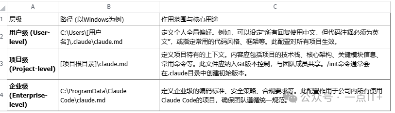
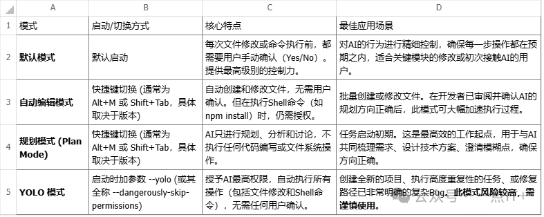
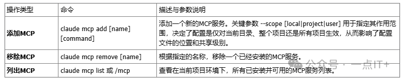

# Claude Code 技术白皮书：高级功能与最佳实践

**作者**: 一点IT+  
**发布时间**: 2026年2月18日 08:00

---

引言：重新定义开发者与AI的协作范式Claude Code 并非又一个AI编程辅助工具，它是引发软件开发协作范式变革的催化剂。其核心设计理念，是将AI的角色从被动的“辅助者”提升为主动的“主要编码者”，而人类开发者的角色则战略性地转变为需求定义者、高质量上下文的供给者以及高级策略的指导者。正如技术布道者“土妹土妹”所强调，开发者99%的代码都可由AI生成，其核心竞争力已转变为思维能力。同时，如“数字黑魔法”的实践所示，开发者应将70%的精力投入到“规划模式”中，这正是从“代码实现者”到“策略指导者”转变的具体体现。这种从传统IDE的图形用户界面（GUI）到命令行的交互转变，并非简单的形式变化，而是为了更好地释放AI在理解和操作整个项目层面的巨大潜力。为充分发挥其强大效能，首先需要构建一个稳定可靠的基础环境，这是通往未来软件工程新世界的第一步。

* * *

1.基础环境搭建与配置1.1. 核心依赖与安装成功部署并运行Claude Code，依赖于两大核心技术栈的正确安装与配置。

*   Node.js: Claude Code本身是基于Node.js构建的，对其版本有明确要求。为确保稳定性和兼容性，强烈建议安装 20或更高版本的LTS（长期支持）版本。
*   Git: Git不仅是版本控制的基石，更是Claude Code运行的底层依赖。其关键原因在于，Claude Code依赖Git安装包中的bash.exe作为其底层的Shell命令执行环境。因此，正确安装Git并将其bin目录添加到系统PATH中是必不可少的。

以下是一个清晰的四步安装与验证流程：

1.  安装Claude Code: 打开终端（如PowerShell或CMD），执行NPM全局安装命令。
2.  验证安装: 安装完成后，通过检查版本号来验证安装是否成功。
3.  升级工具: 为确保使用最新功能和修复，应定期运行升级命令。
4.  配置环境变量: 这是关键一步。必须将Git的可执行文件路径（例如 C:\\Program Files\\Git\\bin）添加到系统的PATH环境变量中。这确保了Claude Code在任何工作目录下都能找到并调用其赖以执行Shell命令的bash.exe环境。

1.2. 网络代理配置对于特定地理区域的用户，为了确保Claude Code的联网工具（如Web Search）能够顺利访问外部服务（如Google），配置网络代理至关重要。以下是三种主流的配置方法及其评估：

*   代理工具TUN模式: 评价为最简单直接、一劳永逸的方式，推荐大多数用户首选。只需开启代理客户端的全局TUN模式，即可将系统所有流量导入代理，无需对Claude Code进行额外配置。
*   临时环境变量 (PowerShell): 其作用域仅限于当前终端会话，适合临时测试或在不同项目中切换代理的场景。
*   项目级配置文件 (settings.json): 最稳健的团队协作方案。在项目根目录的 .claude 文件夹下创建 settings.json 文件，可将代理配置纳入版本控制，确保团队环境一致性。

1.3. IDE集成 (/ide)为了弥合纯命令行交互与可视化编码之间的鸿沟，Claude Code提供了与主流IDE（以VS Code为例）的深度集成。通过在VS Code中安装“Claude Code for VS Code”插件，并运行 /ide 命令进行连接，可以极大地优化开发体验。集成后的两大核心功能包括：

*   上下文感知: Claude Code能够实时感知您在VS Code中选中的代码块。当您提问时，它会自动将选中的代码作为上下文，从而进行更精准的问答、解释或重构。
*   可视化代码差异 (Diff View): 当Claude Code提议修改代码时，VS Code会自动弹出一个差异对比视图（Diff View）。这使得开发者可以直观地审查AI的每一次修改，清晰地看到代码的增删变化，从而做出接受或拒绝的决策。

当基础环境就绪后，要真正驾驭Claude Code，关键在于理解其独特的工作哲学，这将彻底改变您与代码的交互方式。

* * *

2.核心哲学：上下文即代码 (Context-as-Code)2.1. 思维转变：从指令到赋能掌握Claude Code的精髓，需要一次彻底的思维模式转变。与传统AI编程工具（如Cursor）中AI作为“助手”的角色不同，Claude Code将AI定位为“主要执行者”。开发者的角色从亲力亲为的“代码修改者”，演变为运筹帷幄的“高质量上下文提供者”。这意味着，您的核心工作不再是编写或修改代码，而是专注于：

1.  梳理和拆解复杂需求。
2.  向AI提供精准、全面的信息和背景（上下文）。
3.  审查AI的规划并提供关键反馈。

在这种模式下，开发者99%的代码都可以由AI生成。您的核心竞争力，体现在将业务问题转化为清晰技术规划的系统设计能力和问题分解能力上。2.2. 上下文管理的核心：claude.mdclaude.md 文件是Claude Code的“长期记忆”和“系统提示词”，是实现高质量上下文管理的核心。它通过分层设计，实现了从个人偏好到企业规范的全面覆盖。  
2.3. 动态上下文构建与维护除了静态的claude.md，开发者还需掌握一套动态的上下文管理工具。正如专家所比喻的，将上下文管理视作“内存管理”，这是确保AI高效、专注工作的关键。

*   /init: 此命令会扫描整个项目的文件结构和内容，自动生成一份初始的 claude.md 文件。这是让AI快速建立对项目基础认知的起点。
*   /compact: 在长对话后，此命令如同“垃圾回收”，能智能压缩对话历史，排除已解决的问题，有效防止“内存溢出”（即上下文窗口超限），从而降低token消耗并保持AI专注。
*   /clear: 当开启新任务时，此命令用于“清空内存”，提供一个干净的上下文环境，避免旧信息对新任务产生干扰。
*   # (记忆模式): 这是一个强大的快捷方式。输入 # 后跟随您想让AI记住的信息，可以直接将其永久性地写入项目级或用户级的 claude.md 文件中，实现长期记忆的快速更新。
*   中间产物的重要性: 这是专家级用户的核心技巧。在处理复杂任务时，应要求AI先生成详细的计划、分析或设计方案，并将其保存为独立的Markdown文件（即“中间产物”）。这种做法能有效规避单次对话的上下文窗口限制。在开启新的会话时，只需让AI读取这些中间文档，即可快速恢复关键信息，继续执行后续任务。

精细化的上下文管理是确保AI输出质量的生命线。掌握了如何“喂给”AI高质量的信息后，下一步就是学习如何驾驭它的执行流程。

* * *

3.交互模式与核心命令详解3.1. 四大核心交互模式Claude Code通过四种设计精巧的交互模式，赋予开发者在自动化执行与精细化控制之间灵活切换的能力。  
3.2. 常用斜杠/命令参考掌握以下核心斜杠命令，将极大提升日常开发效率。

*   项目与上下文:

*   /add-dir \[路径\]: 将指定的目录添加到当前工作上下文中，让AI能够感知和操作多个文件夹。
*   /memory: 快速打开并编辑项目级 (project) 或用户级 (user) 的 claude.md 文件，便于直接修改长期记忆。
*   /status: 显示当前Claude Code的详细状态信息，包括版本号、工作路径、当前模型、API端点和代理设置等。

*   会话管理:

*   /resume: 查找并恢复到之前的某个历史对话会话，便于从中断处继续工作。
*   /export: 将当前完整的对话历史复制到系统剪贴板，方便进行存档、分享或使用其他大模型进行交叉验证。

*   模型行为控制:

*   /model: 查看当前可用的AI模型列表，并支持在线切换模型。
*   think | harder | deep | ultra: 在提问时加入这些关键词（强度递增），可以指示AI进行更深层次、更长时间的思考。这对于需要复杂推理和规划的任务尤其有效。

3.3. 命令行快捷指令Claude Code与原生命令行深度集成，提供了两个极具效率的快捷指令。

*   ! \[command\] 使用感叹号 ! 作为前缀，可以在不退出Claude Code会话的情况下，直接执行临时的Shell命令（例如 !npm install 或 !git status）。更重要的是，该命令的执行过程和输出结果，都会被自动捕获并纳入当前的对话上下文中，供AI参考。
*   claude -p "\[prompt\]" 这是一种“非交互模式”。它允许您从外部命令行直接向Claude Code传递一个指令并执行。Claude Code会在后台处理该任务，并将最终结果打印到终端后自动退出。这使其成为一个强大的命令行智能助手，非常适合集成到脚本或自动化流程中。

掌握了基础交互之后，真正的力量来自于通过自定义和自动化工具，将Claude Code的能力提升到新的高度。

* * *

4.高级自动化与工作流定制4.1. 自定义命令 (/custom\_command)Claude Code允许开发者超越内置命令，创建符合个人或团队特定需求的个性化、可复用的工作流。自定义命令的创建过程如下：

1.  创建目录: 在项目级的 .claude/commands/ 或用户级的 ~/.claude/commands/ 目录下操作。前者仅对当前项目生效，后者对所有项目生效。
2.  创建命令文件: 在上述目录中，创建一个Markdown文件（.md）。文件名即为命令名。例如，codereview.md 文件将对应 /codereview 命令。
3.  编写命令逻辑: 文件的内容就是对该命令行为的自然语言描述。您需要清晰地告诉AI，当这个命令被调用时，它应该执行哪些步骤。
4.  使用参数: 您可以在命令逻辑中使用 $argument 占位符，来接收和处理调用命令时传入的参数。
5.  示例：代码评审命令: 一个典型的例子是创建一个 /codereview \[branch\_name\] 命令。在codereview.md文件中，您可以这样描述：“请使用git diff main...$argument命令，对比当前分支与main分支的代码差异，然后根据差异内容，生成一份详细的代码评审（Code Review）意见。” 当您执行 /codereview feature-branch 时，Claude Code就会自动执行这一系列操作。

4.2. 自动化钩子 (Hooks)Hooks是一种强大的自动化机制，它允许在Claude Code工作流的特定事件节点，自动触发预定义的Shell命令。这种机制能够将质量保证流程自动化，将开发者从琐碎的“代码保洁”任务中解放出来，从而更专注于架构层面的监督——这正是新开发范式的核心宗旨。以一个经典场景为例：要求AI修改代码后，自动运行代码格式化检查。其配置步骤如下：

1.  定位配置文件: 在项目的 .claude 目录下，找到 settings.json 或 settings.local.json 文件（local文件优先级更高）。
2.  定义Hook结构: 在配置文件中添加 hooks 对象。指定触发时机为 post-tool-use（即某个工具使用后），并指定触发工具为 edit.apply（即代码编辑工具应用修改后）。
3.  指定执行命令: 在 run 字段中定义需要自动执行的Shell命令，例如 npx prettier --check .。
4.  评估其影响: 配置完成后，每当AI提交一次代码修改，该Hook就会被触发，自动运行Prettier进行格式检查。如果AI提交的代码不符合格式规范，检查会失败，其错误信息会返回到对话上下文中。Claude Code会意识到这个问题，并主动进行自我修正，从而实现代码质量的自动化守护。

4.3. 并行任务处理器 (Sub-agents)Sub-agent可以类比为编程中的“子线程”，是处理复杂、多步骤任务的利器。当主Agent接收到一个复杂请求时，它可以将任务分解，并分配给多个专职的Sub-agent并行处理。其核心优势体现在：

*   任务并行化: 对于没有先后依赖关系的任务，Claude Code会自动将其分配给不同的Sub-agent并行执行。例如，你可以同时命令一个“代码审查大师”Sub-agent审查分支，并命令另一个“天气预报大师”Sub-agent查询青岛的天气。这两个任务将被并行处理，显著提升整体效率。
*   上下文隔离: 每个Sub-agent都拥有自己独立的、为特定任务而精简的上下文环境。它不会被主对话中的海量信息所“污染”，从而保证了执行的高度专注度和成功率。
*   结果可预测性: 您可以为每个Sub-agent定义专门的职责和能力，例如创建一个“代码审查大师”或一个“天气预报大师”。这种专职化使得单一任务的输出结果更加稳定和可控。

所有Sub-agent执行完毕后，主Agent会整合所有子任务的结果，并向用户提供一个最终的、完整的回答。强大的定制能力需要与外部生态系统结合才能发挥最大威力，下一章将探讨如何将Claude Code与外部工具和服务无缝集成。

* * *

5.生态系统集成与外部工具5.1. 外部CLI工具调用Claude Code能够无缝调用任何已安装在系统中、且路径已添加到PATH环境变量的命令行工具（CLI）。这为其赋予了无限的扩展能力。以 gh (GitHub CLI) 为核心，我们可以构建一个从需求获取到代码交付的端到端自动化开发流程：

1.  读取任务: 开发者发出指令：“请查看GitHub上编号为#123的Issue，并进行修复。” Claude Code会调用 gh issue view 123 命令，读取Issue的详细内容，从而完全理解需求。
2.  本地开发: 理解需求后，Claude Code在本地自动创建一个新的修复分支（如 fix/issue-123），并对相关代码文件进行修改以解决问题。
3.  代码提交: Claude Code使用内置的 git 命令（如 git add . 和 git commit -m "Fix: issue #123"）提交代码更改。
4.  推送远程: 最后，Claude Code调用 gh pr create 并结合 git push，将本地的修复分支推送到GitHub，并自动创建一个关联到该Issue的Pull Request。

这个工作流打通了从需求管理平台到代码仓库的完整闭环，形成了一个高效、自动化的开发与交付生态。5.2. 模型上下文协议 (MCP)模型上下文协议（Model Context Protocol, MCP）可以被理解为AI与外部工具交互的“标准化工具箱”。它充当一个中间层，让AI能够像人类一样，通过标准化的接口去“操作”外部系统和服务。MCP的管理和使用主要通过以下命令：  
以下是几个MCP的实际应用实例，展示了其多样化的能力：

*   Cortex: 一个用于查询最新技术文档的MCP。当AI遇到其知识库之外的新技术或API时，可以通过Cortex获取实时、准确的官方文档，从而补充知识。
*   Chrome DevTools MCP: 赋予AI自动化控制浏览器的能力，可以执行打开网页、页面截图、模拟点击、填写表单等一系列Web自动化操作。
*   Database MCP (示例): 允许AI直接连接并查询数据库。AI可以根据自然语言提问，自动生成SQL查询语句，并返回数据结果。

5.3. 可视化前端：Cloudia对于不习惯纯命令行界面的用户，社区提供了Cloudia——一个基于Claude Code构建的开源桌面应用，它为强大的后端能力提供了友好的图形化界面。Cloudia的核心价值与特色功能包括：

*   可视化管理: 将命令行中的高级功能，如MCP管理、Sub-agent配置、自定义命令和Hooks添加等，都通过GUI界面进行操作，降低了使用门槛。
*   多标签页与历史管理: 采用多标签页设计，便于用户同时管理多个项目和对话上下文，极大地提升了多任务处理的便利性。
*   时间线导航 (Checkpoints): 这是Cloudia最受好评的杀手级功能。它允许用户在对话过程中的任意时间点创建一个“检查点”（Checkpoint），这个快照会同时保存当前项目的代码文件状态和完整的对话历史。用户可以随时一键将整个工作区（代码和对话）回滚到任意一个历史检查点。相比Claude Code内置的 /resume 命令只能恢复对话历史，Cloudia的检查点功能在状态回溯和项目版本管理方面具有压倒性的优势。
*   安装注意: 需要注意的是，Cloudia主项目仓库通常不提供预编译的安装包。用户可以参照社区专家的指引，在GitHub上寻找该项目活跃的、提供安装包的派生版本(fork)进行安装。

生态系统的集成将Claude Code的能力从代码本身扩展到了整个软件开发生命周期。接下来，我们将所有知识融会贯通，探讨如何构建高效的最佳实践工作流。

* * *

6.高级工作流与最佳实践6.1. 实践工作流：从新功能开发到Debug综合前述所有知识，我们为开发者提炼出两套标准化的实践工作流。此工作流的核心是将开发者的精力从编码转移到战略规划和质量控制上。严格遵循此流程，是实现AI作为“主要编码者”而开发者作为“架构师”这一范式转变的关键。A. 新功能开发工作流（七步法）

1.  明确需求 (/init & Plan Mode): 首先，使用 /init 让Claude Code读取整个代码库，建立初步认知。然后，切换到规划模式，通过对话共同明确新功能的需求，并鼓励AI提问以澄清所有模糊点。
2.  研究与方案设计 (Web Search): 如果涉及新技术或未知领域，指示AI使用联网工具进行网络搜索，探索可行的解决方案和最佳实践。
3.  技术选型与计划审阅 (Plan Mode): 仔细审阅AI提出的初步计划，包括技术选型、架构设计和实现步骤。在这一阶段提供反馈和调整，确保方案符合预期。
4.  计划固化 (think harder): 要求AI使用 think harder 模式，将最终确定的详细计划写入一个独立的Markdown文件。这份文件将作为后续执行的“蓝图”和重要的上下文备份。
5.  分阶段执行 (Phase-by-Phase): 从固化的计划文档中，选取第一阶段的任务，让AI只针对该阶段进行具体的代码实现规划。
6.  代码实现审阅: 仔细审查AI为当前阶段提出的具体文件修改和代码逻辑。这是最后的人工质量把关环节，确保逻辑正确、代码优雅。
7.  自动执行 (YOLO 或 Auto-Edit Mode): 在确认所有修改无误后，切换到YOLO模式或自动编辑模式，授权AI执行代码的实际编写工作。

B. 调试(Debug)工作流

1.  清空上下文 (/clear): 开启一个干净的会话，清晰地描述Bug的具体表现、复现步骤和预期行为。
2.  添加调试信息: 指示AI思考并添加必要的日志打印（如 console.log）来帮助定位问题根源，而不是直接猜测修复方案。这是科学调试的第一步。
3.  复现并分析: 运行修改后（带有日志）的代码，复现Bug，然后将包含调试信息的完整输出结果复制给AI进行分析。
4.  迭代与修复 (Plan Mode): 与AI在规划模式下讨论并确定最终的修复方案，确认无误后，再授权其执行代码修改。
5.  清理现场: Bug成功修复后，下达最后一道指令：命令AI移除所有之前为调试而添加的日志代码，保持代码库的整洁。

6.2. 核心实践准则遵循以下五条黄金准则，将帮助您真正驾驭Claude Code，发挥其最大效能。

*   规划优先于执行: 将70%以上的时间投入到规划模式中，与AI反复沟通、审阅和完善计划。这是确保项目成功的关键，所谓“谋定而后动”。
*   小步快跑，迭代开发: 避免让AI一次性进行大规模的代码变更。建议将每次变更的代码量控制在200行以内，这样便于审查和控制，有效避免AI失控或引入难以发现的潜在问题。
*   精细化管理上下文: 将上下文管理视为操作系统中的“内存管理”。频繁使用 /compact 和 /clear 保持上下文的清爽和专注，并善于利用中间文档来持久化关键信息，以备不时之需。
*   永远保持开发者主导: 永远保持开发者主导。AI可能因未能完全理解整个代码库而重新实现一个已有的函数，导致代码冗余。开发者的职责是100%理解项目架构，主动发现并纠正此类错误，而不是盲目接受AI的产出。
*   适度使用工具: 核心目标是提升效率。不应盲目追求最新、最复杂的MCP或工作流。很多时候，将基础功能（如规划模式、上下文管理）运用到极致，其威力同样强大。

遵循这些实践，将帮助开发者从“使用者”蜕变为真正的“驾驭者”，引领AI协作开发的新浪潮。

* * *

7.结论：迈向未来的软件工程Claude Code通过其独特的命令行交互范式、深度的上下文管理哲学以及强大的自动化与定制能力，正在深刻地重塑软件开发的边界。它不仅仅是一个工具，更是一种全新的工作方式，推动着开发者角色的战略性转变。在这一新范式下，开发者将从繁琐的编码实现中解放出来，更加专注于创造性、系统设计和复杂问题的解决。软件工程的未来，将是一个人机协作更为紧密、创新效率空前提升的新纪元，而Claude Code，正是开启这扇大门的关键钥匙。
