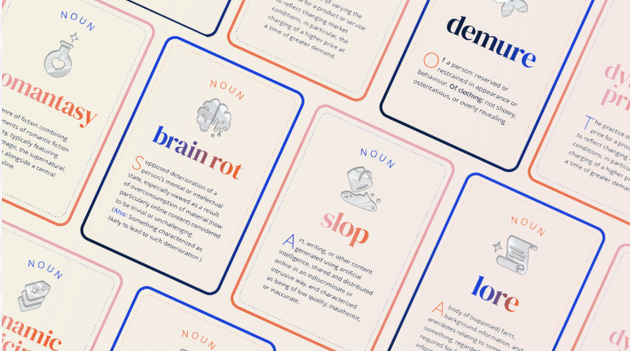
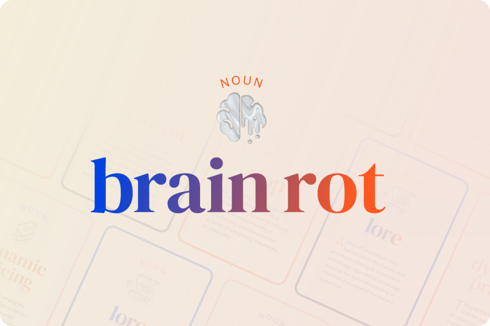
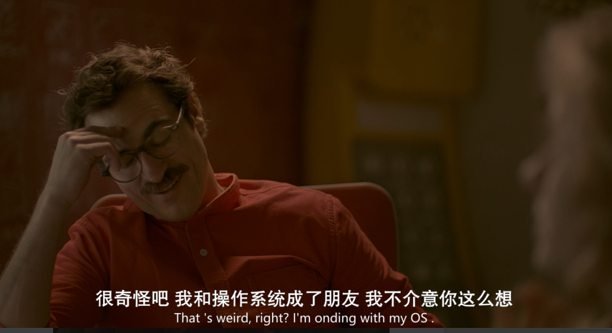

# 自从知道 “脑腐（brain rot）”这个词，我开始有意识地少用 AI

**作者**: 月亮是一盏关不掉的灯  
**发布时间**: 2025年9月2日 19:03

---

整理工作文件夹时，翻到三年前带手写批注的笔记 —— 辑打磨的痕迹，也有反复修改的创意点。对比如今打开文档先搜 “AI 生成 XX 要点”、改改名称便交差的状态，不禁心生警惕：**我们何时开始失去 “深度思考” 的能力？**

  

直到上英语课时接触 **“脑腐（brain rot）”** 概念，答案逐渐清晰。

***“脑腐”：被便利掩盖的思维退化***

2024年，英国牛津大学出版社给出了一个刺耳却精准的年度词汇：**Brain rot（脑腐）。**

所谓“脑腐”，字面意思即“大脑腐化”，形容个体或群体在信息过载与认知封闭的环境中出现的思维僵化或认知退化的现象。**算法推荐内容下的认知疲劳，DeepSeek等AI工具对人的创造能力的“剥夺”以及自我效能感的丧失，沉迷短视频、社交媒体等低价值内容导致的大脑功能退化等，都被视为脑腐的表征。**

  

据牛津大学的说法，它最早出现在1854年亨利·大卫·梭罗出版的经典著作《瓦尔登湖》中，梭罗在讲述了他独自搬到林中小屋的故事时提到了这个词：

***“While England endeavors to cure the potato-rot,” Thoreau lamented, “will not any endeavor to cure the brain-rot, which prevails so much more widely and fatally?”***

***“当英格兰努力治愈土豆烂病时，难道没有人努力治愈更广泛、更致命的脑腐吗？”***

实际上，当前“脑腐”说的再次流行是对数字智能技术发展到“自主化”新阶段的一种担忧的反映。

  

薛定谔曾说 “人活着是对抗熵增”，而 AI 时代，我们还需对抗 “脑腐”。

  

大脑天然倾向 “省力”，AI 恰好提供了最优省力路径：无需查资料，AI 可总结；无需理逻辑，AI 可梳理；无需组文案，AI 可生成。

**但这种 “省力” 本质是大脑的 “主动躺平”—— 我们将本该完成的 “思考闭环” 拱手相让，久而久之，思维便如长期不锻炼的肌肉，逐渐失去力量。**

***日常中的 “脑腐” 信号***

回溯日常，“脑腐” 早已渗透细节：

遇问题第一反应是 “问 AI”，而非先翻权威资料、拆解问题核心；读文章依赖 AI “重点摘要”，跳过需咀嚼的段落，丧失梳理逻辑的耐心。

  

这类行为看似省时，实则持续消耗思考力 —— 如同吃他人嚼过的饭，虽能果腹，却失却食物本味，更无法锻炼自身 “咀嚼” 能力。

  

**“脑腐” 的可怕之处，正在于让我们从 “思考者” 退化为 “AI 传声筒”。**

***“抗脑腐” 的核心：拒绝思维惰性***

能守住思考力的群体，多在践行 “抗脑腐” 行动。这背后是对 “思维惰性” 的克制与对 “思考成就感” 的追求：

  

依赖 AI 是典型的思维惰性：快速获结果如尝甜糖，当下满足却转瞬空虚；主动思考需耗时查资料、耗力理逻辑，甚至承受试错挫败，但最终得出答案时，“能独立解决问题” 的踏实感，是 AI 无法提供的。

  

**AI 时代的 “下坡路”，本质是放弃大脑的 “思考权”。**

***3个 “抗脑腐” 的小tips***

从细微处着手，可逐步找回思考感：

  

**给 AI 设 “边界”：**不让 AI 处理 “自身可完成” 的事。如查问题时，先在纸上明确 “核心需求”“所需信息类型”，通过权威渠道初步验证后，再用 AI 补充未考虑的维度，**让 AI 回归 “助手” 而非 “替身”。**

  

**留 “无 AI 时间”：**每日固定时段关闭 AI 工具，选择深度阅读（非 AI “精华解读”）或手写日记 —— 即便记录零散，也能倒逼大脑主动梳理想法。

  

**借小事锻炼思维：**脱离 AI 指导完成具体事务（如按自身经验调整菜谱用量），从试错中积累独立判断能力。

***AI 时代，守住思考力才是核心***

电影《她》台词

  

AI 无疑是高效工具，能显著节省时间与精力，但工具的价值在于辅助而非替代 ——**如剪刀可剪纸却无法设计图案，计算器可运算却无法传递数学逻辑，AI 也无法替代大脑的核心思考功能。**

  

“脑腐” 并非 AI 普及的必然结果，而是对 “便利” 过度依赖的产物。

  

不妨从当下做起：写短句不依赖 AI，查问题先自主梳理，读文章拒绝 “摘要” 依赖 —— 在 AI 时代守住思考力，成为 “会想、敢想、能想” 的独立个体，而非 AI 的 “传声筒”。

  

我是大朔，这里记录我在 AI 时代的思考与试错，愿与你一同在便利与深度思考间找到平衡，逐步成长为具备独立思维的个体。

  

  

[【每日一问】Deep Seek：如果你变成了人，你最想干什么？](https://mp.weixin.qq.com/s?__biz=MzU2OTM3OTc2MA==&mid=2247484518&idx=1&sn=d9d3b6f595202e74467fddeb60cae816&scene=21#wechat_redirect)

[【每日一问】Deep Seek：柴米油盐酱醋茶为什么会让人感觉幸福？](https://mp.weixin.qq.com/s?__biz=MzU2OTM3OTc2MA==&mid=2247484506&idx=1&sn=e5120ad04a02fd59fe915acde83bde34&scene=21#wechat_redirect)
